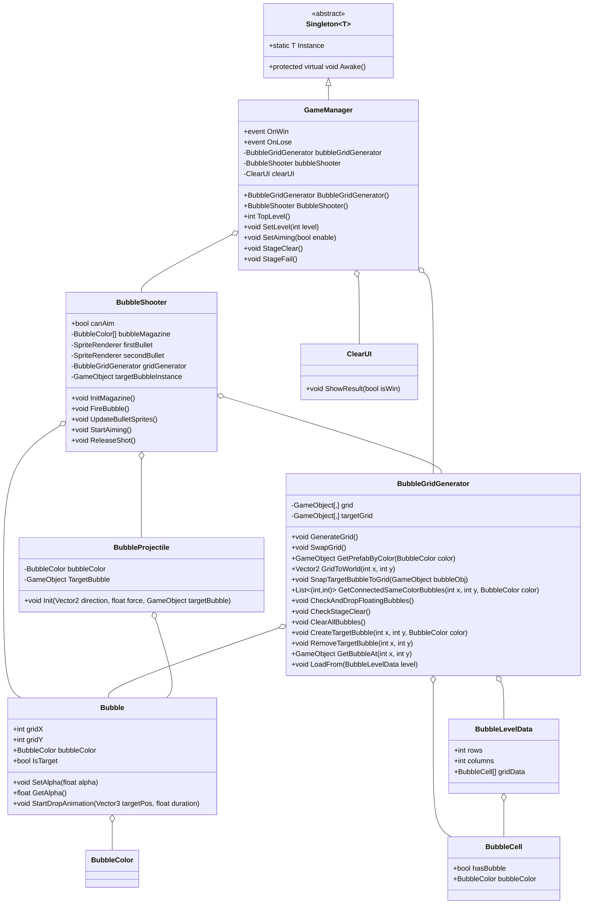
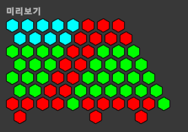

# Bubble Witch Saga

## ✨ 프로젝트 개요

Bubble Witch Saga는 Unity 기반의 2D 버블 슈팅 퍼즐 게임입니다.  
플레이어는 다양한 색상의 버블을 발사하여 같은 색의 버블을 3개 이상 맞추면 제거할 수 있습니다.  
스테이지 클리어, 진행 시스템, UI, 탄창(버블 탄환) 등 다양한 게임 시스템을 구현하였습니다.

## 🎮 조작 방법
  - 마우스 왼쪽 버튼을 누른 상태에서 조준선을 따라 방향을 정합니다.  
  - 버튼을 떼면 조준 방향으로 버블이 발사됩니다.  
  - 너무 짧게 클릭(0.2초 이하)하면 발사가 취소됩니다.  
  - 치트키(예: Space키)를 누르면 모든 버블이 즉시 제거됩니다(디버그용).

---

## 🛠️ 설치 방법
  - [유니티 빌드 압축 파일 구글 드라이브 링크](https://drive.google.com/file/d/1p-5G6gKg27p8R-BJ00B0y-FX9VETF2mM/view?usp=sharing) 혹은 [Inno 인스톨러 구글 드라이브 링크]([https://unity.com/](https://drive.google.com/file/d/1yWK2wMjGTkK9VaAOk8QQC_SPhXG-_Oag/view?usp=sharing) 에서 파일을 다운받아 압축 해제 후 빌드 실행(인스톨러의 경우 설치경로 지정 및 설치 과정 추가)

## 🛠️ 주요 기술 및 구조

- **6000.1.7f1 (Unity 6.1)** 기반 2D 게임
- **C#** 스크립트 및 ScriptableObject를 활용한 데이터 관리
- **싱글톤 패턴**을 통한 게임 매니저 관리
- **Input System**을 활용한 입력 처리
- **에디터 확장**(CustomEditor)으로 레벨 데이터 편집 + 도식화된 미리보기 지원
- **벌집(헥사) 그리드** 구조로 버블 배치 및 좌표 변환 로직 구현

---

## 클래스 다이어그램



---

## 💡 코드 구조 예시

```csharp
// BubbleShooter.cs (일부 발췌)
public class BubbleShooter : MonoBehaviour
{
    private BubbleColor[] bubbleMagazine = new BubbleColor[2];
    [SerializeField] private SpriteRenderer firstBullet;
    [SerializeField] private SpriteRenderer secondBullet;

    public bool canAim = true;

    private void StartAiming()
    {
        if (!canAim) return;
        isAiming = true;
        aimingStartTime = Time.time;
        // ...
    }

    private void ReleaseShot()
    {
        if (!isAiming) return;
        float heldTime = Time.time - aimingStartTime;
        if (heldTime <= 0.2f) return;
        FireBubble();
        // ...
    }

    private void FireBubble()
    {
        // 탄창에서 버블 발사, 탄창 갱신
    }
}
```
```csharp
// BubbleGridGenerator.cs (일부 발췌)
public class BubbleGridGenerator : MonoBehaviour
{
    public int rows = 12;
    public int columns = 11;
    public float bubbleRadius = 0.5f;

    private GameObject[,] grid;
    private GameObject[,] targetGrid;

    public void GenerateGrid()
    {
        // 그리드에 버블 생성
    }

    public Vector2 GridToWorld(int x, int y)
    {
        // 그리드 좌표를 월드 좌표로 변환
    }

    public (int, int) FindNearestGridIndex(Vector2 worldPos)
    {
        // 월드 좌표에서 가장 가까운 그리드 인덱스 반환
    }

    public bool IsCellOccupied(int x, int y)
    {
        // 해당 셀이 비어있는지 여부 반환
    }

    public void ClearAllBubbles()
    {
        // 모든 버블 제거
    }
    public List<(int, int)> GetNeighbors(int x, int y)
    {
        // 그리드 좌표 6방향 탐색해 이웃 반환
    }
    public void CheckAndDropFloatingBubbles()
    {
        // 그리드에서 떠있는(연결되지 않은) 버블을 찾아 낙하시킴(BFS)
    }
}
```
---
- **스크립터블 오브젝트로 맵 데이터 관리(CustomEditor를 통해 맵 배치 미리보기 가능)**
- 

---

## 📝 구현 및 설계 포인트

- **싱글톤 GameManager**  
  - 씬 전환에도 파괴되지 않으며, 게임의 전역 상태와 이벤트를 관리합니다.
- **버블 그리드/타겟 관리**  
  - BubbleGridGenerator가 버블의 생성, 삭제, 위치 변환, 클리어 체크 등 모든 그리드 로직을 담당합니다.
- **버블 슈터 입력 및 발사 제어**  
  - 마우스(또는 터치) 입력을 통한 조준 및 발사, 궤적 예측선을 실시간으로 표시합니다.  
  - 너무 짧은 클릭(0.2초 이하)이나 유효하지 않은 타겟에는 발사가 취소되어 오동작을 방지합니다.
- **타겟 버블 및 궤적 시각화**  
  - 조준 시 실제로 버블이 붙을 위치에 반투명 타겟 버블을 미리 보여주고, 궤적 점(dot)으로 경로를 시각화합니다.  
  - 벽 반사, 버블 충돌 등 다양한 상황을 정확하게 예측하여 표시합니다.
- **입력 시스템**  
  - Unity Input System을 활용하여 PC/모바일 모두 대응이 쉽도록 구현하였습니다.
- **에디터 확장**  
  - 레벨 데이터와 버블 배치 편집을 위한 커스텀 에디터를 제공합니다.
- **이벤트 기반 스테이지 클리어/실패 처리**  
  - OnWin, OnLose 이벤트를 통해 UI 및 게임 상태를 일관성 있게 관리합니다.

---
